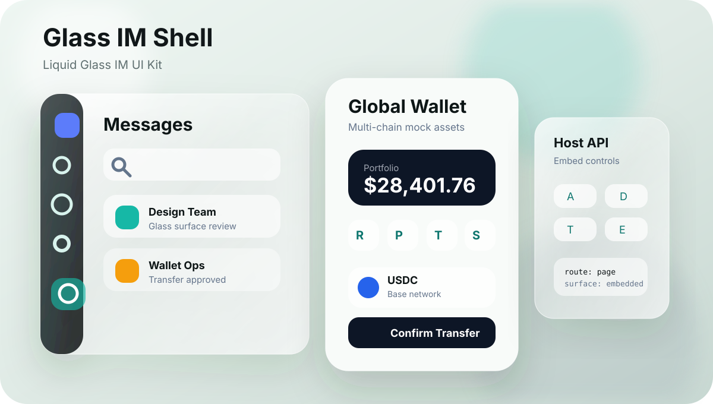

# Glass IM Shell

<p align="center">
  
</p>

Glass IM Shell is an original liquid-glass IM UI kit inspired by common messaging app patterns. It provides a static, embeddable shell for messages, contacts, discovery, profile, global crypto wallet, settings, and deep detail flows.

## Status

| Area | Current state |
| --- | --- |
| Runtime | Static HTML/CSS/JS with `window.GLASS_IM_CONFIG` and `window.GlassIMShell` |
| Surfaces | Fullscreen, phone preview, embedded host example, host API example |
| Verification | Release audit, Beta readiness report, mobile route matrix, browser smoke, package preview, CI workflow |
| Data | Fictional mock data with host overrides through `schema.d.ts` |
| Positioning | Original generic IM shell, no third-party product identity |

## Quick Start

```bash
npm install
npm run serve:local
```

Open `http://127.0.0.1:5500/`.

Phone preview: `http://127.0.0.1:5500/mobile.html`

Embedded example: `http://127.0.0.1:5500/examples/vanilla.html`

Host API example: `http://127.0.0.1:5500/examples/host-api.html`

npm-style minimal example: `http://127.0.0.1:5500/examples/npm-minimal.html`

See `docs/LOCAL_PREVIEW.md` for canonical local review ports, cache reset guidance, and mobile deep-page URLs.

## Embed

```html
<link rel="stylesheet" href="/glass-im-shell/styles.css" />
<div id="chat-shell"></div>
<script>
  window.GLASS_IM_CONFIG = {
    root: "#chat-shell",
    surface: "embedded",
    lang: "en",
    appearance: "system",
    density: "comfortable",
    route: "page:pay",
    onEvent(event) {
      console.log(event.type, event.payload);
    }
  };
</script>
<script src="/glass-im-shell/script.js"></script>
```

See `INTEGRATION.md` for data providers, event callbacks, theme tokens, and the runtime API. See `docs/HOST_DATA_OVERRIDES.md` for copy-pasteable host data replacement examples.

For package-style setup, install the package, import `glass-im-shell/styles.css`, mount a host container, set `window.GLASS_IM_CONFIG`, then load the runtime entry. The runnable reference is `examples/npm-minimal.html`.

See `docs/API_CONTRACT.md` for stable runtime methods, route strings, host selectors, event payloads, and data replacement rules.

## Verification

```bash
npm run release:check
npm run smoke:playwright
npm pack --dry-run
```

Or run the full local CI sequence:

```bash
npm run ci:verify
```

## Release Assets

The README preview is an original vector asset at `docs/assets/glass-im-shell-preview.svg`.

Browser screenshots are generated by `npm run smoke:playwright` into `output/smoke/`, including mobile wallet transfer, mobile video feed, embedded wallet, host API, and dark compact runtime API states. See `docs/RELEASE_ASSETS.md`.

Use `docs/SCREENSHOT_ACCEPTANCE_MAP.md` to map each generated screenshot to its route, smoke case, automated checks, manual review focus, and no-go conditions.

Use `docs/RELEASE_DRAFT.md` as the release note starting point for GitHub releases. Use `docs/BETA_READINESS_REPORT.md` for the final pre-Beta go/no-go review, `docs/HUMAN_ACCEPTANCE_ROUTE.md` for the one-page manual route, `docs/PRE_RELEASE_ACCEPTANCE.md` for human screenshot, flow, package, and release-boundary acceptance, `docs/PUBLICATION_READINESS.md` for final repository metadata and publisher sign-off, `docs/FIRST_COMMIT_MANIFEST.md` for the first public commit boundary, and `docs/REPOSITORY_LAUNCH_CHECKLIST.md` for the first public repository launch gate.

Use `docs/GITHUB_RELEASE_GUIDE.md` for the first public repository release sequence.

## Disclaimer

This project is not affiliated with, endorsed by, sponsored by, or connected to any third-party messaging platform, wallet product, or social app. It does not include third-party trademarks, official icons, screenshots, brand assets, or product artwork.

All names, contacts, messages, groups, channels, balances, files, and profile data are fictional mock data. Simulated celebrity-style contacts are invented personas and do not refer to real people, likenesses, endorsements, or commercial relationships.

## Included Flows

- Messages, contacts, discovery, and profile navigation
- Conversation list, message thread, composer, attachments, and chat detail panel
- Message action menu, reply preview, simulated forwarding/saving/copying/deleting events
- Simulated image, file, location, pass, saved item, gift, and transfer composer tools
- Contact requests, internationalized directory sorting, group summaries, grouped labels, channels, relationship status, and simulated block/remove flows
- Activity timeline with simulated like/comment actions, immersive short-video feed with CSS symbol actions, scanner, nearby surface, plugin center, global crypto wallet, saved items, credentials, stickers, and settings
- Chat search, chat files, group management, remark fields, and friend permissions
- Account security, device management, notifications, chat settings, privacy, general settings, storage cleanup, about, saved items, passes, stickers, and help
- Add-contact, receive, pay, transfer, and swap mock wallet flows with network status, address book, transaction records, fee preview, risk notice, and route preview
- Responsive mobile flow from list to detail and back
- Phone app preview shell at `mobile.html`
- Mobile deep-page layering and safe-area layout for app-like navigation
- CSS glyph icon system for common global actions and entry points
- Automatic Chinese/English startup language based on the browser locale, with an in-app language toggle
- Automatic light/dark adaptation through `prefers-color-scheme`
- Host-controlled appearance and density through `setAppearance()`, `setDensity()`, and `configure()`
- Standalone and embedded surface modes, so host pages can avoid global scroll/background takeover
- Embeddable configuration through `window.GLASS_IM_CONFIG`
- Runtime API through `window.GlassIMShell`
- TypeScript integration schema in `schema.d.ts`
- Stable `data-glass-shell` / `data-glass-*` attributes for host E2E tests and screenshots

## Integration

See `HOST_READINESS.md` for the pre-Beta checklist used to validate host integration, visual boundaries, data ownership, and release packaging. See `docs/BETA_READINESS_REPORT.md` for the consolidated readiness status, evidence, risks, and final release steps. See `docs/PRE_RELEASE_ACCEPTANCE.md` for the final human acceptance pass.

## Architecture

See `ARCHITECTURE.md` and `src/module-map.json` for the pre-Beta module boundaries, public contract, refactor rules, and size budgets.

See `docs/API_CONTRACT.md` for the host-facing API contract that should stay stable across pre-Beta integration work.

## UI Implementation Spec

See `docs/UI_IMPLEMENTATION_SPEC.md` for the 100% UI implementation target, public runtime contract, information architecture, screen documentation model, component documentation model, wallet model, state model, and acceptance gates.

See `docs/PAGE_MATRIX.md` for public screens, routes, entry points, primary actions, host events, and page-level acceptance notes.

See `docs/COMPONENT_MATRIX.md` for stable navigation, list, chat, contact, explore, wallet, settings, overlay, state, and CSS glyph component patterns.

See `docs/DESIGN_TOKENS.md` for appearance, density, surface, color, glass material, typography, spacing, radius, motion, glyph, wallet, mobile safe-area, and embedded host token rules.

See `docs/WALLET_IMPLEMENTATION.md` for the wallet data model, asset row contract, supported mock asset universe, receive, pay, transfer, swap, records, fee/risk display, and wallet host events.

See `docs/STATE_MATRIX.md` for empty, loading, error, disabled, permission, and host-owned state rules.

See `docs/HOST_DATA_OVERRIDES.md` for static data, async provider, runtime replacement, people, chats, activity, video, wallet, profile, theme, and empty-state override examples.

## Package Metadata

See `docs/PACKAGE_METADATA.md` for npm metadata, package entry points, package allowlist rules, and repository URL fields to fill after the final public location exists.

## Supply Chain

See `docs/SUPPLY_CHAIN.md` for dependency boundaries, script boundaries, CI permissions, package contents, and wallet mock boundaries.

## Release Audit

Run the release audit before publishing:

```bash
npm run release:check
```

The audit checks script syntax, release manifest consistency, i18n/API integrity, static UI accessibility basics, reduced-motion support, architecture boundaries, supply chain boundaries, risky product references, restricted asset formats, and required open-source boundary documents.
It also checks the npm package preview so local logs, generated screenshots, dependency folders, and workflow files do not ship in the package.

`release-manifest.json` records the expected version, package files, release docs, smoke screenshots, public surfaces, entry points, and release boundaries.

## Browser Smoke

For browser-level checks, install Playwright locally and run:

```bash
npm i -D playwright
npx playwright install chromium
npm run smoke:playwright
```

The smoke runner starts a static server on `5500-5509`, checks fullscreen and embedded surfaces, validates the mobile deep-route matrix, checks wallet hash routes, wallet asset row structure, wallet action events, wallet form styling, focus, Escape behavior, basic control accessibility, runtime API state changes, and writes screenshots to `output/smoke/`.

## CI

The repository includes `.github/workflows/ci.yml`. It installs dependencies, installs Chromium for Playwright, runs `npm run release:check`, runs `npm run smoke:playwright`, runs `npm pack --dry-run`, and uploads smoke screenshots for failed review.

Run the same local sequence with:

```bash
npm run ci:verify
```

## Contributing And Security

See `CONTRIBUTING.md` for local setup, review expectations, and project boundaries for new UI surfaces.

See `docs/MAINTAINER_GUIDE.md` for issue triage, pull request review, release process, package boundary, and documentation ownership.

See `SECURITY.md` for supported versions and responsible reporting guidance. Do not post secrets, private keys, access tokens, or exploitable reports in public issues.

## Design Positioning

The information architecture is intentionally generic: it follows common IM conventions without copying any single product's protected branding, assets, or exact visual identity. The UI uses original names, original CSS icon shapes, fictional data, and a liquid-glass treatment.

## License Scope

The license covers only the original code, layout, styling, and fictional mock data contained in this repository. It does not grant rights to any third-party trademarks, product designs, names, logos, screenshots, or assets.
